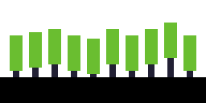

# Lens Board - Journal 1 - 15/05/2025

Lensboard is a keyboard! I did hackpad v1, but didn't get to do hackpad v2 due to exams :(
Other than being a keyboard, Lensboard has some unique features...

### Introducing...

ANALOG INPUTS!
Physical controls are the single most satisfying thing in the world. Clicky, scrolly, wavy, whatever - as long as it's physical, it's fun.

## The Plan

Quick overview:

- 1800 Compact Layout (Fullsize but squished)
- Low profile
- White backlight
- RGB underglow
- Audio Visualizer (physical)
- Scrolly Wheel (clicky)
- Fader
- Mini touchscreen (for color pickers, music player)

### Audio Visualizer

Basically, this is a line of little rods, that move up and down based on a fft of the audio input. They're moved by ten litte stepper motors (because servos are noisy as hell).

Here is my amazing diagram:

And these little green bars will move up and down with audio.

### Scrolly Wheel

Its a scrolly wheel!

Apologies for my absolutely atrocious drawing skills, but here is what I'm thinking for the profile. 

This will likely be 3d printed, and use a rotary encode so its nice and clicky.

### Fader

I'm a bit of a lighting nerd, and as you know, lighting nerds love faders.

This is just a user mappable fader, but I'll probably set it up as a lighting thing, so I can move it and have stuff happen with lights in my room lol.

### Mini Touchscreen

I just like the idea of having a tiny little display in the corner.

It'll probably have a little media control center or color picker for art stuff or lighting programming.

#### Welp...
Thats me for today! I'm gonna start some research on parts for tomorrow's entry, but thats my overall vision for this project. Looking forward to getting this going!
