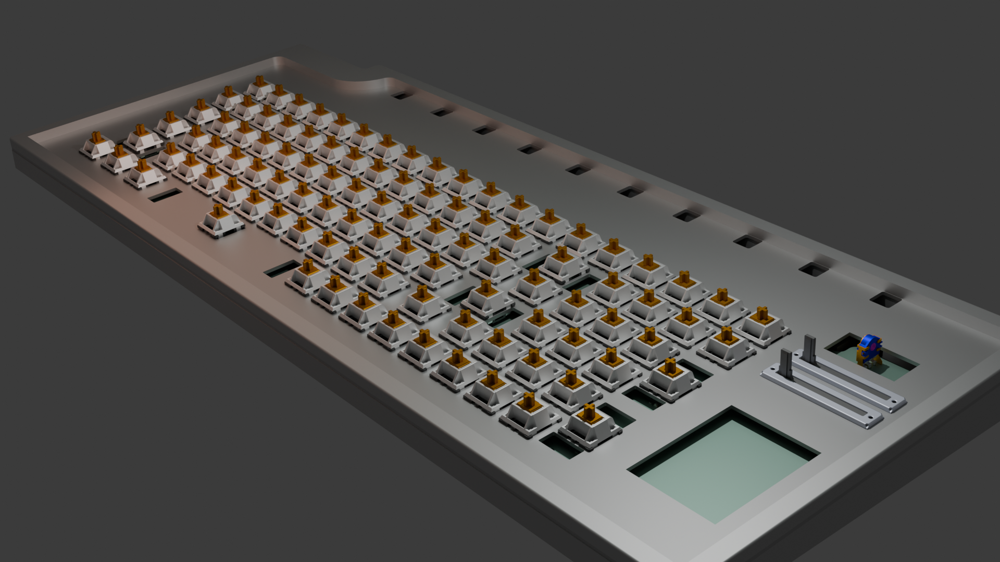
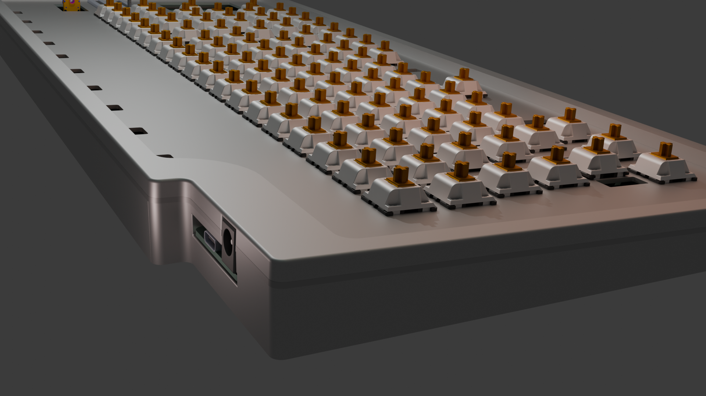

# Lens Board

Lens Board is a custom mechanical keyboard, with a modified 1800's layout, more physical input methods (sliders, scrolly wheel, touchscreen) and an inbuilt, *physical* audio visualizer.

#### The Why

My inspiration for this project was my [Hackpad](https://hackpad.hackclub.com/) project, which I had a ton of fun designing and building. I wanted to make another thing to do with keyboards, and this was a great opportunity to do so.

In terms of the actual design choices of the keyboard, I'm a massive fan of analog / physical inputs and outputs. As a musician and LD, I like faders, so a few of those were an obvious choice. 

I decided to add a music visualizer because its just something I'm passionate about, putting some form of visual representation to sound. I do lighting for this reason, and I made my [music visualizer](https://cookiemonsternz.github.io/music-visualiser/) for high seas also because of this.

Anyways, here are some shots of my project :)

## BOM

For a nicer formatted bom, visit this [google sheet](https://docs.google.com/spreadsheets/d/1ZwZEnQPNZCf3j8q_c9diwTeRiC4rXLwVUGGG0oGG0jM/edit).

### Daughterboard

 Item | Part Name | Quantity | Source | Link | Unit Cost | Total Cost | Notes 
---|---|---|---|---|---|---|---
 U1 | RP2040 | 1 | JLCPCB Parts | https://jlcpcb.com/partdetail/RaspberryPi-RP2040/C2040 | 1.12 | 1.12 |  
 U2 | Voltage Regulator | 1 | JLCPCB Parts | https://jlcpcb.com/partdetail/bl_shanghai_belling-BL111733CX/C5400 | 0.05 | 0.05 | You can also use C26537, but its a bit more expensive 
 U3 | Flash Mem. | 1 | JLCPCB Parts | https://jlcpcb.com/partdetail/WinbondElec-W25Q128JVSIQ/C97521 | 0.74 | 0.74 |  
 U4 | Crystal Oscillator | 1 | JLCPCB Parts | https://jlcpcb.com/partdetail/AbraconLlc-ABM8_272T3/C20625731 | 0.36 | 0.36 |  
 U5, U6 | IO Expander | 2 | JLCPCB Parts | https://jlcpcb.com/partdetail/MicrochipTech-MCP23017T_EML/C629439 | 1.55 | 3.1 |  
 J1 | DC Barrel Jack | 1 | JLCPCB Parts | https://jlcpcb.com/partdetail/ShouHan-DC005/C431533 | 0.05 | 0.05 |  
 J2 | USB C Conn | 1 | JLCPCB Parts | https://jlcpcb.com/partdetail/Korean_HropartsElec-TYPE_C_31_M12/C165948 | 0.17 | 0.17 |  
 J3 | 2x30 Pin Header | 1 | Aliexpress | https://www.aliexpress.com/item/32214180690.html?spm=a2g0o.productlist.main.11.62007aa28osNlK&algo_pvid=4aeb8a1d-9196-4dce-9fd8-8f74cdbfb503&algo_exp_id=4aeb8a1d-9196-4dce-9fd8-8f74cdbfb503-10&pdp_ext_f=%7B%22order%22%3A%2212%22%2C%22eval%22%3A%221%22%7D&pdp_npi=4%40dis%21USD%210.76%210.76%21%21%210.76%210.76%21%402103246617503783498077610ef0cd%2112000023678787662%21sea%21NZ%212895682434%21X&curPageLogUid=gqU9QpHzRo8G&utparam-url=scene%3Asearch%7Cquery_from%3A | 0.15 | 0.15 |  
 R1, R2 | 1kΩ Resistor | 2 | JLCPCB Parts | https://jlcpcb.com/partdetail/12256-0402WGF1001TCE/C11702 | 0.01 | 0.02 |  
 R3, R4 | 27.4Ω Resistor | 2 | JLCPCB Parts | https://jlcpcb.com/partdetail/25848-0402WGF330JTCE/C25105 | 0.01 | 0.02 | Using 33Ω resistors instead here, technically not to spec, but will almost certainly still work 
 R5, R6 | 5.1kΩ Resistor | 2 | JLCPCB Parts | https://jlcpcb.com/partdetail/26648-0402WGF5101TCE/C25905 | 0.01 | 0.02 |  
 R7, R8 | 4.7kΩ Resistor | 2 | JLCPCB Parts | https://jlcpcb.com/partdetail/26643-0402WGF4701TCE/C25900 | 0.01 | 0.02 |  
 C1, C2 | 10uF Capacitor | 2 | JLCPCB Parts | https://jlcpcb.com/partdetail/20411-CL10A106KP8NNNC/C19702 | 0.01 | 0.02 | 0603, all other smd r and c are 0402 
 C3, C4, C5, C6, C7, C8, C9, C12, C13, C14 | 100nF Capacitor | 10 | JLCPCB Parts | https://jlcpcb.com/partdetail/1877-CL05B104KO5NNNC/C1525 | 0.01 | 0.1 |  
 C10, C11 | 1uF Capacitor | 2 | JLCPCB Parts | https://jlcpcb.com/partdetail/16531-CL10A105KB8NNNC/C15849 | 0.01 | 0.02 | 0603, all other smd r and c are 0402 
 C15, C16 | 15pF Capacitor | 2 | JLCPCB Parts | https://jlcpcb.com/partdetail/1900-0402CG150J500NT/C1548 | 0.01 | 0.02 |  
 BOARD | PCB Board | 1 | JLCPCB | NA | 0.8 | 0.8 | Excl. PCBA, default settings (1.6mm fr4), this is assuming 5 ordered, and this is the cost of 1 
 PCBA | PCB Assembly |  |  |  | 21.01 | 21.01 | This includes the cost of parts, so the cost of jlcpcb parts has been excluded from the total cost, again this is the cost for 1, but min order is 2 
 Total Cost |  |  |  |  |  |  |  
 Single Board |  |  |  |  |  | 21.96 |  
 Min Order (JLCPCB) |  |  |  |  |  | 46.17 |  

### Main Board

 Item | Part Name | Quantity | Source | Link | Unit Cost | Total Cost | Notes 
---|---|---|---|---|---|---|---
 BOARD | PCB Board | 1 | JLCPCB | NA | 5.38 | 5.38 | default settings (1.6mm fr4), this is assuming 5 ordered, and this is the cost of 1 
 J1 | 2x30 Pin Header | 1 | Aliexpress | https://www.aliexpress.com/item/32214180690.html?spm=a2g0o.productlist.main.11.62007aa28osNlK&algo_pvid=4aeb8a1d-9196-4dce-9fd8-8f74cdbfb503&algo_exp_id=4aeb8a1d-9196-4dce-9fd8-8f74cdbfb503-10&pdp_ext_f=%7B%22order%22%3A%2212%22%2C%22eval%22%3A%221%22%7D&pdp_npi=4%40dis%21USD%210.76%210.76%21%21%210.76%210.76%21%402103246617503783498077610ef0cd%2112000023678787662%21sea%21NZ%212895682434%21X&curPageLogUid=gqU9QpHzRo8G&utparam-url=scene%3Asearch%7Cquery_from%3A | 0.15 | 0.15 |  
 R109, R110 | Slide Potentiometer | 2 | Mouser | https://nz.mouser.com/ProductDetail/Bourns/PTA3043-2010CIB103?qs=QARuOjD9jaF0iQfIvhCxcQ%3D%3D | 1.4 | 2.8 | This is a hard part to find on aliexpress, I'm going to adapt my pcb to the ones I currently have, but be very careful how you choose this part 
 U7 | LED Transistor | 1 | Aliexpress | https://www.aliexpress.com/item/32966478417.html | 0.04 | 0.81 | Again, find one with the same footprint and similar specs 
 SW101 | Rotary Encoder | 1 | Aliexpress | https://www.aliexpress.com/item/1005008562951299.html?spm=a2g0o.productlist.main.2.694610473NnPbb&algo_pvid=771bf3ee-44f4-41f8-acc5-89f292c9e139&algo_exp_id=771bf3ee-44f4-41f8-acc5-89f292c9e139-1&pdp_ext_f=%7B%22order%22%3A%22-1%22%2C%22eval%22%3A%221%22%7D&pdp_npi=4%40dis%21USD%213.08%212.74%21%21%2122.00%2119.58%21%402103146c17504851750608347e0951%2112000045732012789%21sea%21NZ%212895682434%21X&curPageLogUid=0EsiDwbyuniA&utparam-url=scene%3Asearch%7Cquery_from%3A | 0.27 | 2.74 | Same as above 
 SW1 - SW 100 | Keyswitches | 100 | Aliexpress | https://www.aliexpress.com/item/1005009054805658.html | 0.23 | 22.81 | Assuming ordering 100 
 D1 - D100 | Key Diodes | 100 | Aliexpress | https://www.aliexpress.com/item/1005005460442161.html | 0.01 | 0.61 | Assuming ordering 100 
 D101 - D200 | Backlight LEDs | 100 | Aliexpress | https://www.aliexpress.com/item/1005005226854182.html | 0.01 | 1.45 | Assuming ordering 100 
 R9 - R108 | LED Resistor | 100 | Aliexpress | https://www.aliexpress.com/item/1005003297851656.html | 0.02 | 1.7 | Assuming ordering 100 
 J3, J4 | Touchscreen | 1 | Aliexpress | https://www.aliexpress.com/item/1005004055677573.html | 6.95 | 6.95 | With touch 
 M1 - M10 | Servo | 10 | Aliexpress | https://www.aliexpress.com/item/1005008626768357.html | 1.8 | 18.29 | 10x 180° MG90s 
 Total Cost |  |  |  |  |  |  |  
 Single Board |  |  |  |  |  | 63.69 |  
 Min Order (JLCPCB) |  |  |  |  |  | 103.11 | Only min order for jlcpcb, not for j1, all others already are min order. 

### Full Keyboard

 Item | Part Name | Quantity | Source | Link | Unit Cost | Total Cost | Notes 
---|---|---|---|---|---|---|---
 MAIN | Main Board | 1 | Various | NA | 81.59 | 103.11 | Total cost is different because of minimum orders 
 SUB | Daughter Board | 1 | Various | NA | 21.96 | 46.17 | Same as above, see individual boms 
 CASEB |  | 1 | 3d printing | NA | NA | NA | 3d printing this myself, not enough filament to compensate 
 CASET |  | 1 | 3d printing | NA | NA | NA | 3d printing this myself, not enough filament to compensate 
 PLATE |  | 1 | Laser cut / cnc | NA | NA | NA | 3d printing this myself, not enough filament to compensate 
 INS | Heatset inserts | 100 | Aliexpress | https://www.aliexpress.com/item/1005006838108683.html | 0.03 | 2.72 | OD 3.2, L3, M2, This is for 100, but couldn't find any smaller amounts 
 STA | Standoffs | 20 | Aliexpress | https://www.aliexpress.com/item/1005002952338852.html | 0.13 | 2.69 | M2, 12mm, 20 pc 
 KC | Keycaps | 100 | Aliexpress | https://www.aliexpress.com/item/1005008486798694.html | 0.05 | 5.44 |  
 Total Cost |  |  |  |  |  |  |  
 Single Board |  |  |  |  |  | 114.4 |  
 Total Cost (excl. Shipping) |  |  |  |  |  | 160.13 |  
 Total Cost (incl. Shipping) |  |  |  |  |  | 168.94 | Aliexpress parts = 70.60, JLCPCB = 98.34 